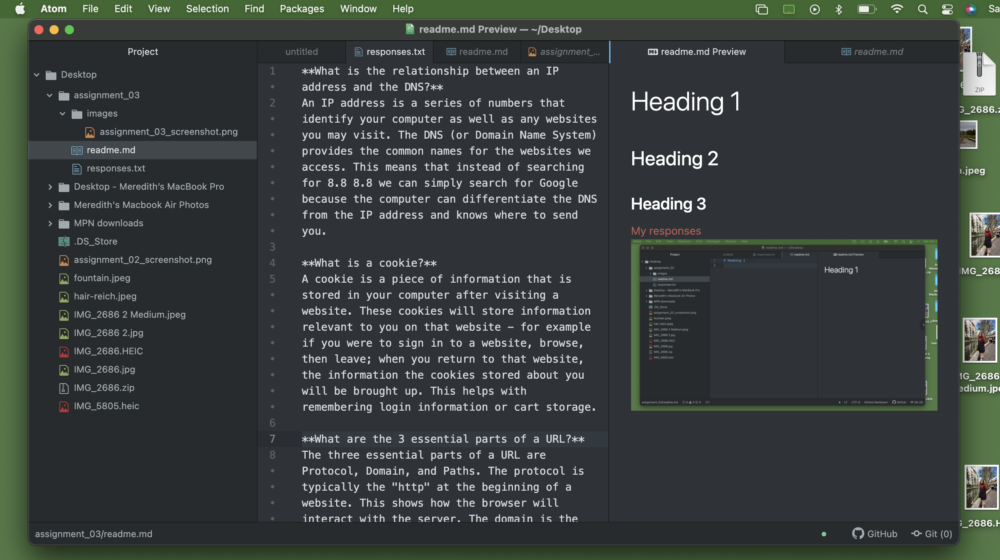

# Week Three
This class has been very entertaining for me, not only because of the content, but because of the format as well. I've found it beneficial for me to be taking at least one class where the homework feels like I am playing a game. Through this game play I have learned a lot already.

First, I knew that there were wires for the internet that connected us globally, but it was very interesting to see the actual wires and how large the infrastructure is to keep us all connected.

Second, I found it very interesting in this chapter to learn about relative and absolute URLs. I knew that Excel used relative and absolute references so I was intrigued to see that of course the internet will use them as well. This vast interconnected system must be so organized in order to give people the information access that they crave.

Finally, I think it is really interesting to see the "coding side" of web development (or at least that is how I have viewed it - I know this is very minimal "coding"). Seeing the complicated editing side of building these repositories has taught me that I have so much more to further learn in this course because it is amazing to see how much you can manipulate and customize.

[This week's responses](./responses.txt)

