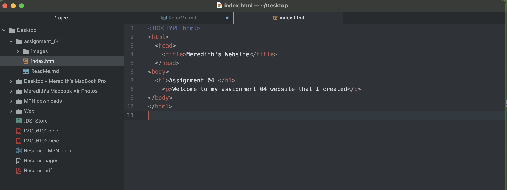

# Assignment 04
 A web browser works by servers receiving requests from the browser for the page you're trying to reach. The server obtains the information and sends it to the browser which has multiple components that it uses to break down the information. Components such as rendering engines, browser engines, and network communication are all utilized in order to form the website you are trying to view.

 I most frequently use Chrome for my browser.

