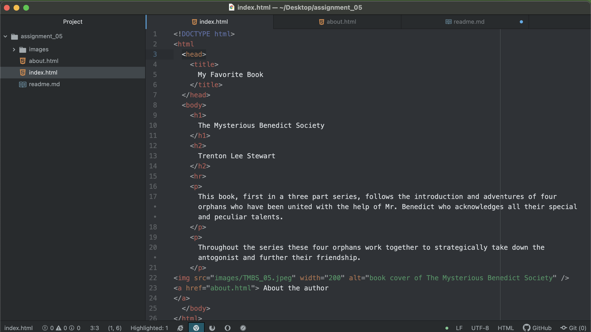

Using the Wayback Machine I visited amazon.com. I viewed the site mostly from 2004 - it differs from the current version of the website in only a few ways.

The website still has many of the same attributes that it has currently, but you can definitely tell you are viewing it from 2004. Rather than tons of images advertising products, it is links to broad categories to begin your searches.

The main scroll area of the website was occupied by seasonal products (valentines chocolates in February).

