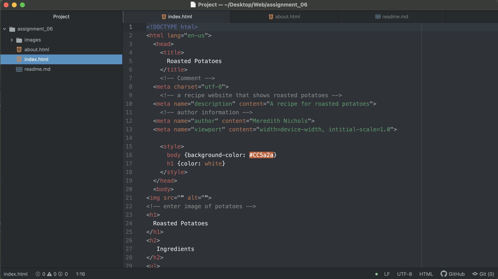

## The difference between semantic and structural markup
Structural markup refers to the elements of a page like the headings or the body. This type of markup is typically dealing with the layout of the page.

Semantic markup refers to different qualities of the content. Semantic markup is useful in adding emphasis and additional information to the content you are providing, whereas the structural markup tends to enhance and change the layout or view of your site.

