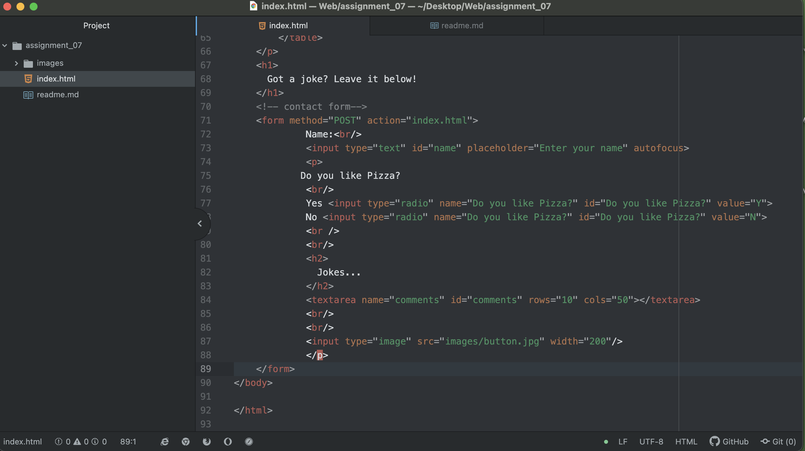

  Many of the forms I come across are contact forms - like done in this week's example. Others are special delivery forms, or notes to a sender. I like forms like this because they are a lot less pressure than emailing someone to contact them. Even if most forms go to someone's email, the platform of using a form to communicate is more appealing, personally.
  The purpose of these forms is to communicate information between people, and with one-sided information forms are an awesome way to do that.

  
