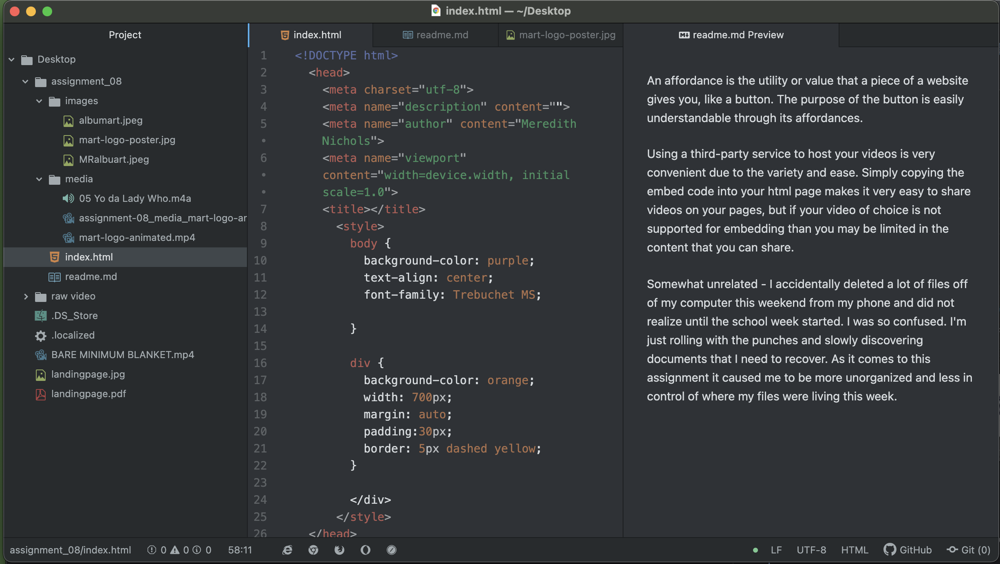

An affordance is the utility or value that a piece of a website gives you, like a button. The purpose of the button is easily understandable through its affordances.

Using a third-party service to host your videos is very convenient due to the variety and ease. Simply copying the embed code into your html page makes it very easy to share videos on your pages, but if your video of choice is not supported for embedding than you may be limited in the content that you can share.

Somewhat unrelated - I accidentally deleted a lot of files off of my computer this weekend from my phone and did not realize until the school week started. I was so confused. I'm just rolling with the punches and slowly discovering documents that I need to recover. As it comes to this assignment it caused me to be more unorganized and less in control of where my files were living this week.

  
