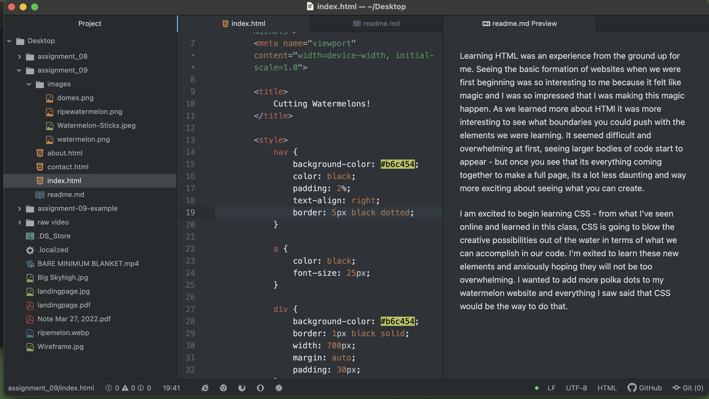

Learning HTML was an experience from the ground up for me. Seeing the basic formation of websites when we were first beginning was so interesting to me because it felt like magic and I was so impressed that I was making this magic happen. As we learned more about HTMl it was more interesting to see what boundaries you could push with the elements we were learning. It seemed difficult and overwhelming at first, seeing larger bodies of code start to appear - but once you see that its everything coming together to make a full page, its a lot less daunting and way more exciting about seeing what you can create.

I am excited to begin learning CSS - from what I've seen online and learned in this class, CSS is going to blow the creative possibilities out of the water in terms of what we can accomplish in our code. I'm exited to learn these new elements and anxiously hoping they will not be too overwhelming. I wanted to add more polka dots to my watermelon website and everything I saw said that CSS would be the way to do that.

