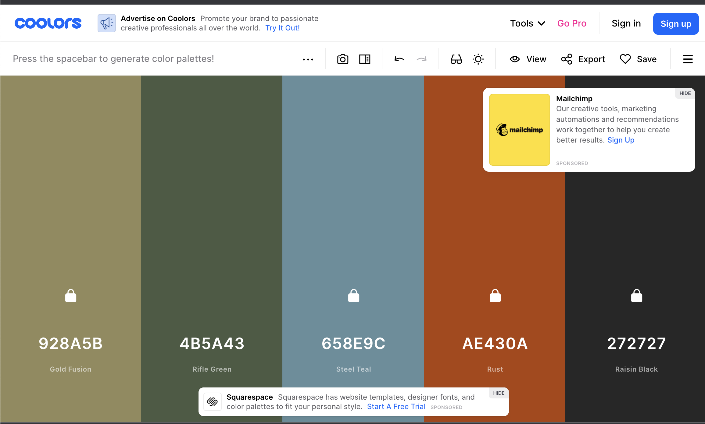
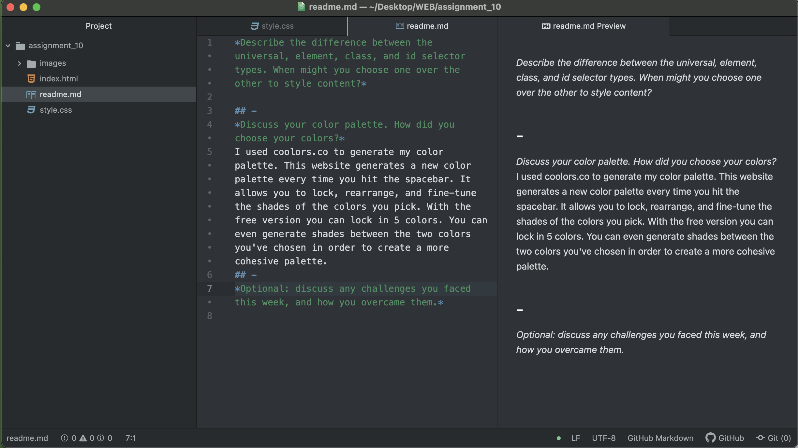
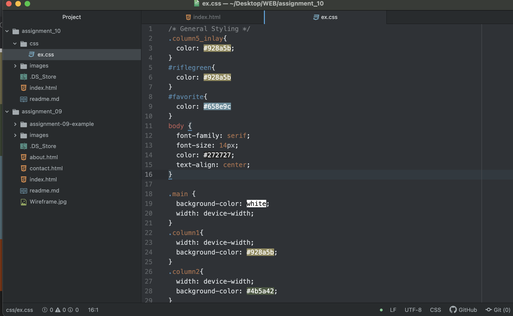

**Describe the difference between the universal, element, class, and id selector types. When might you choose one over the other to style content?**

**-**
The *universal selector* (*) is used to select all elements in a document that you want to stylize. Prepending the rules with a * will apply that rules to every element in your document.

**-**
The *element selector* is when you prepend your rules with the name of the specific element you are trying to manipulate.

**-**
The *class selector*, much like the element selector, is where you prepend the rules with the class label of the thing you are trying to stylize. For example if your div element read:
###### < div class="introduction">  hello < /div>

  Introduction is your class and any rules prepended with "introduction" will be selected and changed

  **-**
 Finally, the *ID selector* works just like the class selector.
###### < div class="introduction" id="first">  hello </div

  First would be your ID for this div element- any rules prepended with "first" will be selected and manipulated by the rules that follow.

Choosing between which of these selectors to choose would probably vary based on how many elements you have and what you are trying to change. With multiple elements, the Element selector may be too broad for the style choices you are trying to make - narrowing down to an ID or Class selector would be much more convenient and specific. When changing something like font it may be best to choose the Universal selector, this will ensure cohesive font choice throughout your page(s)
## -
**Discuss your color palette. How did you choose your colors?**

I used coolors.co to generate my color palette. This website generates a new color palette every time you hit the spacebar. It allows you to lock, rearrange, and fine-tune the shades of the colors you pick. With the free version you can lock in 5 colors. You can even generate shades between the two colors you've chosen in order to create a more cohesive palette.

I chose these colors because this is like the color palette of my life. When I worked at a summer camp and the girls would make me bracelets they would get mad when I picked the same colors of thread over and over. But man, orange and green just have a hold on me like no other. The splash of blue is an accent color and the black is in preparation for a website - my base color.

## -
**Optional: discuss any challenges you faced this week, and how you overcame them.**

Honestly I spent HOURS choosing those colors. Hours and hours of clicking the spacebar. I had so many other variations first - I could make color palettes ALL DAY.

In more seriousness... I had to do some research to figure out how to configure my page for this week in the way that I wanted. I was getting extremely frustrated that some of my changes weren't appearing. Then I remembered about cascading in CSS, copy and pasted my code to the top of the document and bingo bango, changes were made. This was really nice because I did not want to do the work to figure out why it wasn't changing. I also just spent so long playing with HEX codes within my CSS file that I started to mix up my codes and the color were NOT looking how they were supposed to. I'm pretty sure I fixed them all and now my page is the five colors I picked and I'm kinda obsessed with it. I hope you like it :) I wanted the colors in the palette to be the main focus of the page so that's why it is the only content. I tried to put in some jokes, some people think I'm funny, some people don't, that is their loss.

