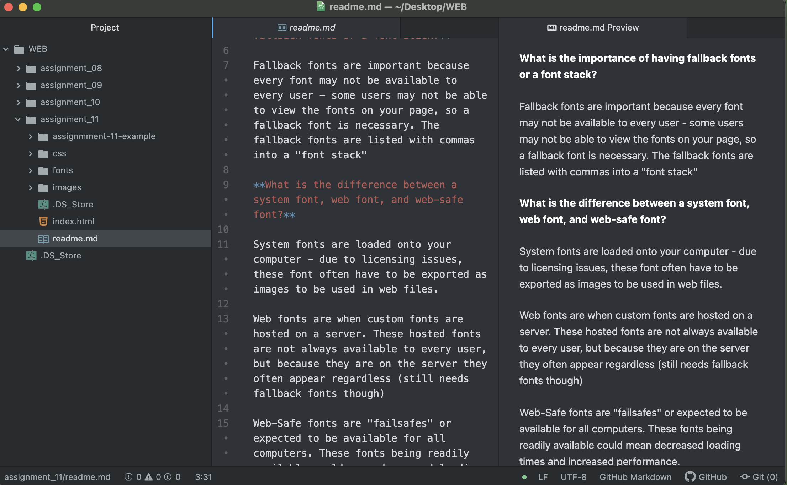

**What is typography?**

Typography is the science essentially of arranging letters on the page. Using different sizes, weights, and fonts to ensure the body of text is legible and fitting for the content.

**What is the importance of having fallback fonts or a font stack?**

Fallback fonts are important because every font may not be available to every user - some users may not be able to view the fonts on your page, so a fallback font is necessary. The fallback fonts are listed with commas into a "font stack"

**What is the difference between a system font, web font, and web-safe font?**

System fonts are loaded onto your computer - due to licensing issues, these font often have to be exported as images to be used in web files.

Web fonts are when custom fonts are hosted on a server. These hosted fonts are not always available to every user, but because they are on the server they often appear regardless (still needs fallback fonts though)

Web-Safe fonts are "failsafes" or expected to be available for all computers. These fonts being readily available could mean decreased loading times and increased performance.

