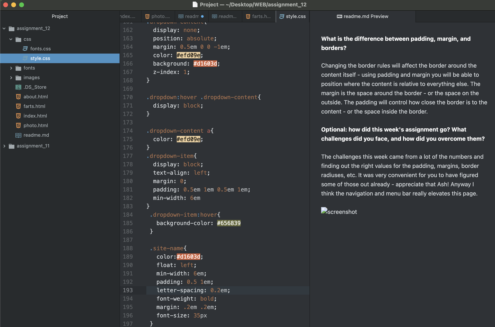

**What is the difference between padding, margin, and borders?**

Changing the border rules will affect the border around the content itself - using padding and margin you will be able to position where the content is relative to everything else. The margin is the space around the border - or the space on the outside. The padding will control how close the border is to the content - or the space inside the border.

**Optional: how did this week's assignment go? What challenges did you face, and how did you overcome them?**

The challenges this week came from a lot of the numbers and finding out the right values for the padding, margins, border radiuses, etc. It was very convenient for you to have figured some of those out already - appreciate that Ash! Anyway I think the navigation and menu bar really elevates this page.

