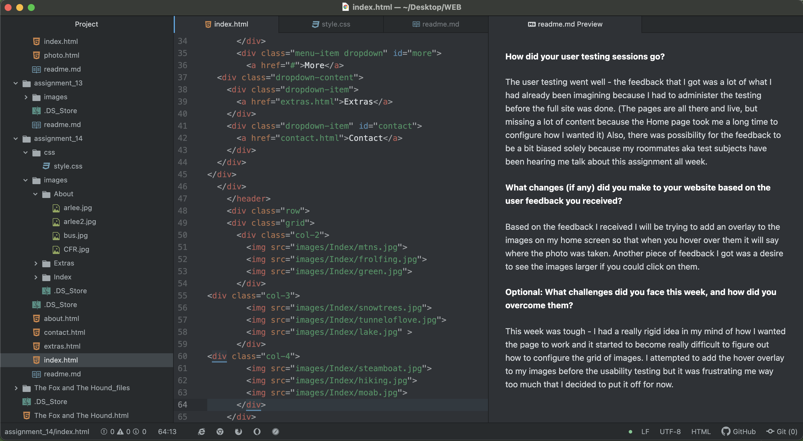

**How did your user testing sessions go?**

The user testing went well - the feedback that I got was a lot of what I had already been imagining because I had to administer the testing before the full site was done. (The pages are all there and live, but missing a lot of content because the Home page took me a long time to configure how I wanted it) Also, there was possibility for the feedback to be a bit biased solely because my roommates aka test subjects have been hearing me talk about this assignment all week.

**What changes (if any) did you make to your website based on the user feedback you received?**

Based on the feedback I received I will be trying to add an overlay to the images on my home screen so that when you hover over them it will say where the photo was taken. Another piece of feedback I got was a desire to see the images larger if you could click on them.

**Optional: What challenges did you face this week, and how did you overcome them?**

This week was tough - I had a really rigid idea in my mind of how I wanted the page to work and it started to become really difficult to figure out how to configure the grid of images. I attempted to add the hover overlay to my images before the usability testing but it was frustrating me way too much that I decided to put it off for now.

